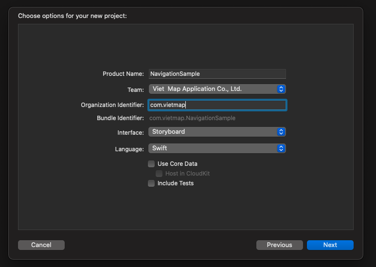
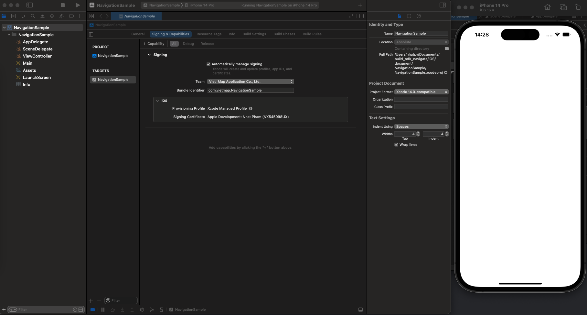
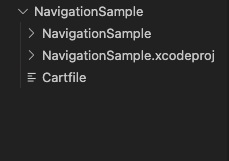
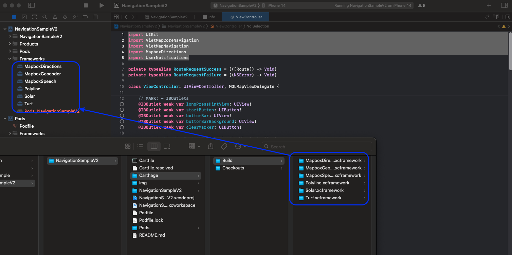
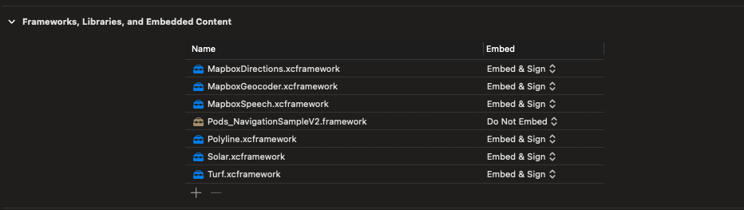
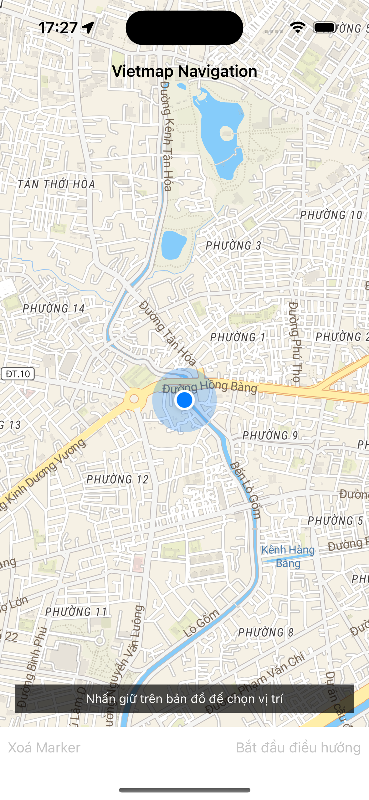

# Tài liệu hướng dẫn cài đặt VietMap Navigation iOS SDK

## Mục lục
1. [Cài đặt môi trường.](/README.md#1-cài-đặt-môi-trường)
2. [Tạo project Navigation với xcode.](/README.md#2-tạo-project-navigation-với-xcode)
3. [Import thư viện.](/README.md#3-import-thư-viện)
4. [Các sự kiện.](/README.md#4-các-sự-kiện)
5. [Xây dựng project](/README.md#5-xây-dựng-project)

## Cài đặt iOS SDK Navigation

### 1. Cài đặt môi trường.

Cài đặt Homebrew<br>
Kiểm tra brew<br>
```
$ brew --version
```
Nếu Homebrew chưa được cài đặt, bạn sẽ thấy:
```
$ zsh: command not found: brew
```
Nếu Homebrew chưa được cài đặt, sử dụng lệnh sau:
```
$ /bin/bash -c "$(curl -fsSL https://raw.githubusercontent.com/Homebrew/install/HEAD/install.sh)"
```

Cài đặt Carthage
```
$ brew install carthage
```

Cài đặt pod
```
$ brew install cocoapods
```

### 2. Tạo project Navigation với xcode.

* Tạo project với Swift và Storyboard
Mở xcode, chọn File > New > Project



Đảm bảo project chạy thành công. Nếu thành công sẽ nhận được layout như hình dưới.



### 3. Import thư viện.

* Tạo Cartfile bằng cách mở terminal và chạy lệnh sau:

```
$ cd ~/path/to/NavigationSample
$ touch Cartfile
```

File Cartfile sẽ được tạo tại thư mục path/to/NavigationSample



Để đảm bảo Cartfile có đầy đủ quyền để xây dựng thư viện, sử dụng lệnh sau:

```
$ chmod +x Cartfile
```

Mở file Cartfile thêm 2 dòng sau và lưu lại:

```
github "mapbox/turf-swift" ~> 0.2
github "ceeK/Solar" ~> 2.1.0
github "vietmap-company/maps-sdk-speech-ios" ~> 1.0.0
github "vietmap-company/maps-sdk-geocoder-ios" ~> 1.0.0
github "vietmap-company/maps-sdk-directions-ios" ~> 1.0.0
```

Sau đó chạy lệnh sau:

```
$ carthage bootstrap --platform iOS --use-xcframeworks
```

**Lưu ý: Nếu build carthage bị lỗi "file libarclite_iphoneos.a not found". Vui lòng tham khảo cách fix tại đây**

https://stackoverflow.com/questions/75574268/missing-file-libarclite-iphoneos-a-xcode-14-3

File mới sẽ được tạo:
- Cartfile.resolve: Được chỉ định framework nào sẽ được fetched/built
- Thư mục Carthage: chứa tất cả các framework được build

Tạo thư mục Frameworks trong NavigationSample<br>
Chọn NavigationSample > Chuột phải > New group<br>
Kéo thả tất cả thư mục xcframework trong thư mục Carthage/Build vừa tạo ở trên vào thư mục Frameworks trong xcode như hình dưới:



**Lưu ý: Đảm bảo chuyển đổi Embed thành [Embed & sign]**



* Tạo Podfile bằng cách mở terminal và chạy lệnh sau:

```
$ cd ~/path/to/NavigationSample
$ pod init
```

Mở Podfile và thêm các thư viện sau:

```
pod 'VietMap', '1.0.14'
pod 'VietMapNavigation', '1.0.0'
pod 'VietMapCoreNavigation', '1.0.0'
```

Sau đó chạy lệnh:

```
pod install
```

### 4. Các sự kiện.

[addGestureRecognizer](/README.md#đăng-ký-gesture-recognizer-cho-mapview) : Đăng ký Gesture Recognizer cho mapview

[Directions](/README.md#request-api-để-tìm-kiếm-đường-đi): Request api để tìm kiếm đường đi

[NavigationViewController](/README.md#bắt-đầu-điều-hướng): Bắt đầu điều hướng

Đăng ký lắng nghe sự kiện của quản lý tuyến đường

[routeControllerProgressDidChange](/README.md#đăng-ký-lắng-nghe-sự-kiện-progressdidchange-và-sự-kiện-reroute)

[routeControllerDidReroute](/README.md#đăng-ký-lắng-nghe-sự-kiện-progressdidchange-và-sự-kiện-reroute)

Đăng ký lắng nghe sự kiện của quản lý bản đồ NavigationMapViewDelegate

[didSelect](/README.md#đăng-ký-lắng-nghe-sự-kiện-của-didselect-waypoint-và-route): WayPoint

[didSelect](/README.md#đăng-ký-lắng-nghe-sự-kiện-của-didselect-waypoint-và-route): Route

Đăng ký lắng nghe sự kiện của quản lý việc điều hướng NavigationViewControllerDelegate

[didArriveAt](/README.md#đăng-ký-lắng-nghe-sự-kiện-didarriveat-và-sự-kiện-bycanceling)

[byCanceling](/README.md#đăng-ký-lắng-nghe-sự-kiện-didarriveat-và-sự-kiện-bycanceling)


### 5. Xây dựng project.

Thêm config vào Info.plist</br>

Yêu cầu quyền truy cập vị trí thiết bị.

```
<key>NSLocationAlwaysAndWhenInUseUsageDescription</key>
<string>Get user location</string>
<key>NSLocationAlwaysUsageDescription</key>
<string>Get user location</string>
<key>NSLocationWhenInUseUsageDescription</key>
<string>Get user location</string>
<key>UIBackgroundModes</key>
<array>
    <string>audio</string>
    <string>location</string>
</array>
```

Thêm config Style URL, URL server và API_KEY.

```
<key>VietMapURL</key>
<string>YOUR_STYLE_HERE</string>
<key>VietMapAPIBaseURL</key>
<string>YOUR_SERVER_URL</string>
<key>VietMapAccessToken</key>
<string>YOUR_API_KEY</string>
```

Tạo layout trong Main giống hình dưới, trong đó:<br>
UIView: mapView > hiển thị mapView<br>
UIButton: clearMarker > xoá marker điểm đến<br>
UIButton: startButton > bắt đầu điều hướng<br>
Tham khảo UI hoặc copy paste tại NavigationSample/Main.storyboard 



#### Khởi tạo mapView

```swift
var mapView: NavigationMapView? {
    didSet {
        oldValue?.removeFromSuperview()
        if let mapView = mapView {
            configureMapView(mapView)
            view.insertSubview(mapView, belowSubview: longPressHintView)
        }
    }
}

override func viewWillAppear(_ animated: Bool) {
    super.viewWillAppear(animated)
    startMapView()
}

func startMapView() {
    self.routes = nil
    self.waypoints = []
    self.mapView = NavigationMapView(frame: view.bounds,styleURL: URL(string: styleView))
    // Reset the navigation styling to the defaults if we are returning from a presentation.
    if (presentedViewController != nil) {
        DayStyle().apply()
    }
    Locale.localeVoice = "vi"
}
```

#### Đăng ký Gesture Recognizer cho mapView.</br>
Tạo sự kiện didLongPress để request tìm điểm đến trong bản đồ.

```swift
let longTap = UILongPressGestureRecognizer(target: self, action: #selector(didLongPress(tap:)))
mapView.gestureRecognizers?.filter({ $0 is UILongPressGestureRecognizer }).forEach(longTap.require(toFail:))
mapView.addGestureRecognizer(longTap)
```

Lấy toạ độ và gán marker cho điểm đến trong sự kiện didLongPress.

```swift
@objc func didLongPress(tap: UILongPressGestureRecognizer) {
    guard let mapView = mapView, tap.state == .began else { return }

    if let annotation = mapView.annotations?.last, waypoints.count > 2 {
        mapView.removeAnnotation(annotation)
    }

    if waypoints.count > 1 {
        waypoints = Array(waypoints.suffix(1))
    }
    
    let coordinates = mapView.convert(tap.location(in: mapView), toCoordinateFrom: mapView)
    // Note: The destination name can be modified. The value is used in the top banner when arriving at a destination.
    let waypoint = Waypoint(coordinate: coordinates, name: "Dropped Pin #\(waypoints.endIndex + 1)")
    waypoints.append(waypoint)

    requestRoute()
}
```

#### Request api để tìm kiếm đường đi.</br>
Request để tìm kiếm đường đi với điểm bắt đầu là vị trí hiện tại, điểm đến là vị trí sau khi longPress.
```swift
func requestRoute() {
    guard waypoints.count > 0 else { return }
    guard let mapView = mapView else { return }

    let userWaypoint = Waypoint(location: mapView.userLocation!.location!, heading: mapView.userLocation?.heading, name: "User location")
    waypoints.insert(userWaypoint, at: 0)

    let routeOptions = NavigationRouteOptions(waypoints: waypoints)
    
    requestRoute(with: routeOptions, success: defaultSuccess, failure: defaultFailure)
}

fileprivate func requestRoute(with options: RouteOptions, success: @escaping RouteRequestSuccess, failure: RouteRequestFailure?) {
    let handler: Directions.RouteCompletionHandler = {(waypoints, potentialRoutes, potentialError) in
        if let error = potentialError, let fail = failure { return fail(error) }
        guard let routes = potentialRoutes else { return }
        return success(routes)
    }

    Directions.shared.calculate(options, completionHandler: handler)
}
```

#### Bắt đầu điều hướng.</br>
Bắt đầu điều hướng, ẩn mapView hiện tại đi và thay thế bằng một navigationView.
```swift
func startStyledNavigation() {
    guard let route = self.routes?.first else { return }
    navigationViewController = NavigationViewController(
        for: route,
        styles: [NightStyle()],
        locationManager: NavigationLocationManager()
    )
    navigationViewController.delegate = self
    customStyleMap()
    configureMapView()
    addListenerMap()
    present(navigationViewController, animated: true) {
        self.mapView?.removeFromSuperview()
        self.mapView = nil
    }
}
```
#### Đăng ký lắng nghe sự kiện ProgressDidChange và sự kiện ReRoute.</br>
```swift
private func addListenerMap() {
    NotificationCenter.default.addObserver(self, selector: #selector(progressDidChange(_ :)), name: .routeControllerProgressDidChange, object: nil)
    NotificationCenter.default.addObserver(self, selector: #selector(progressDidReroute(_ :)), name: .routeControllerDidReroute, object: nil)
}
```

progressDidChange trả về dữ liệu route và location trong quá trình di chuyển, sử dụng để thay đổi camera và điều hướng tốt hơn.</br>
Ví dụ bên dưới để lưu vị trí hiện tại và thêm mũi tên chỉ hướng cho ngã rẽ tiếp theo.
```swift
@objc func progressDidChange(_ notification: NSNotification  ) {
    let routeProgress = notification.userInfo![RouteControllerNotificationUserInfoKey.routeProgressKey] as! RouteProgress
    let location = notification.userInfo![RouteControllerNotificationUserInfoKey.locationKey] as! CLLocation
    currentLocation = location
    setCenterIsFirst(location)
    addManeuverArrow(routeProgress)
}
```

progressDidReroute trả về dữ liệu route mới khi vị trí người dùng đi khác tuyến đường ban đầu.
```swift
@objc func progressDidReroute(_ notification: Notification) {
  if let userInfo = notification.object as? RouteController {
      navigationViewController.mapView?.showRoutes([userInfo.routeProgress.route])
      centerMap(userInfo.locationManager.location!)
  }
}
```
#### Đăng ký lắng nghe sự kiện của didSelect waypoint và route.</br>
```swift
extension ViewController: NavigationMapViewDelegate {
  func navigationMapView(_ mapView: NavigationMapView, didSelect waypoint: Waypoint) {
      guard let routeOptions = routes?.first?.routeOptions else { return }
      let modifiedOptions = routeOptions.without(waypoint: waypoint)

      presentWaypointRemovalActionSheet { _ in
          self.requestRoute(with:modifiedOptions, success: self.defaultSuccess, failure: self.defaultFailure)
      }
  }

  func navigationMapView(_ mapView: NavigationMapView, didSelect route: Route) {
      guard let routes = routes else { return }
      guard let index = routes.firstIndex(where: { $0 == route }) else { return }
      self.routes!.remove(at: index)
      self.routes!.insert(route, at: 0)
  }

  private func presentWaypointRemovalActionSheet(completionHandler approve: @escaping ((UIAlertAction) -> Void)) {
      let title = NSLocalizedString("Remove Waypoint?", comment: "Waypoint Removal Action Sheet Title")
      let message = NSLocalizedString("Would you like to remove this waypoint?", comment: "Waypoint Removal Action Sheet Message")
      let removeTitle = NSLocalizedString("Remove Waypoint", comment: "Waypoint Removal Action Item Title")
      let cancelTitle = NSLocalizedString("Cancel", comment: "Waypoint Removal Action Sheet Cancel Item Title")

      let actionSheet = UIAlertController(title: title, message: message, preferredStyle: .actionSheet)
      let remove = UIAlertAction(title: removeTitle, style: .destructive, handler: approve)
      let cancel = UIAlertAction(title: cancelTitle, style: .cancel, handler: nil)
      [remove, cancel].forEach(actionSheet.addAction(_:))

      self.present(actionSheet, animated: true, completion: nil)
  }
}
```

#### Đăng ký lắng nghe sự kiện didArriveAt và sự kiện byCanceling.</br>
didArriveAt sự kiện được phát ra khi user tới đích, byCanceling là sự kiện phát ra khi user cancel điều hướng.
```swift
extension ViewController: NavigationViewControllerDelegate {
    // By default, when the user arrives at a waypoint, the next leg starts immediately.
    // If you implement this method, return true to preserve this behavior.
    // Return false to remain on the current leg, for example to allow the user to provide input.
    // If you return false, you must manually advance to the next leg. See the example above in `confirmationControllerDidConfirm(_:)`.
    public func navigationViewController(_ navigationViewController: NavigationViewController, didArriveAt waypoint: Waypoint) -> Bool {
        cancelListener()
        return true
    }
    
    // Called when the user hits the exit button.
    // If implemented, you are responsible for also dismissing the UI.
    public func navigationViewControllerDidDismiss(_ navigationViewController: NavigationViewController, byCanceling canceled: Bool) {
        cancelListener()
        self.navigationViewController.dismiss(animated: true) {
            self.startMapView()
        }
    }
}
```

SampleCode

```swift
import UIKit
import VietMapCoreNavigation
import VietMapNavigation
import MapboxDirections
import UserNotifications

private typealias RouteRequestSuccess = (([Route]) -> Void)
private typealias RouteRequestFailure = ((NSError) -> Void)

class ViewController: UIViewController, MGLMapViewDelegate {

    // MARK: - IBOutlets
    @IBOutlet weak var longPressHintView: UIView!
    @IBOutlet weak var startButton: UIButton!
    @IBOutlet weak var bottomBar: UIView!
    @IBOutlet weak var bottomBarBackground: UIView!
    @IBOutlet weak var clearMarker: UIButton!
    
    var navigationViewController: NavigationViewController!
    var mapboxRouteController: RouteController?
    var currentLocation: CLLocation!
    var isFirstRender: Bool = false
    var styleView = Bundle.main.object(forInfoDictionaryKey: "VietMapURL") as! String
    
    // MARK: Properties
    var mapView: NavigationMapView? {
        didSet {
            oldValue?.removeFromSuperview()
            if let mapView = mapView {
                configureMapView(mapView)
                view.insertSubview(mapView, belowSubview: longPressHintView)
            }
        }
    }
    
    var waypoints: [Waypoint] = [] {
        didSet {
            waypoints.forEach {
                $0.coordinateAccuracy = -1
            }
        }
    }

    var routes: [Route]? {
        didSet {
            startButton.isEnabled = (routes?.count ?? 0 > 0)
            guard let routes = routes,
                  let current = routes.first else { mapView?.removeRoutes(); return }

            mapView?.showRoutes(routes)
            mapView?.showWaypoints(current)
        }
    }
    
    // MARK: Directions Request Handlers

    fileprivate lazy var defaultSuccess: RouteRequestSuccess = { [weak self] (routes) in
        guard let current = routes.first else { return }
        self?.clearMarker.isEnabled = true
        self?.mapView?.removeWaypoints()
        self?.routes = routes
        self?.waypoints = current.routeOptions.waypoints
        self?.longPressHintView.isHidden = true
    }

    fileprivate lazy var defaultFailure: RouteRequestFailure = { [weak self] (error) in
        self?.routes = nil //clear routes from the map
        print(error.localizedDescription)
    }
    
    override func viewWillAppear(_ animated: Bool) {
        super.viewWillAppear(animated)
        startMapView()
    }

    override func viewDidLoad() {
        super.viewDidLoad()
        if #available(iOS 10.0, *) {
            UNUserNotificationCenter.current().requestAuthorization(options: [.badge, .alert, .sound]) { _,_ in
                DispatchQueue.main.async {
                    CLLocationManager().requestWhenInUseAuthorization()
                }
            }
        }
    }
    
    func startMapView() {
        self.routes = nil
        self.waypoints = []
        self.mapView = NavigationMapView(frame: view.bounds,styleURL: URL(string: styleView))
        // Reset the navigation styling to the defaults if we are returning from a presentation.
        if (presentedViewController != nil) {
            DayStyle().apply()
        }
        Locale.localeVoice = "vi"
    }

    func configureMapView(_ mapView: NavigationMapView) {
        mapView.autoresizingMask = [.flexibleWidth, .flexibleHeight]
        mapView.delegate = self
        mapView.navigationMapDelegate = self
        mapView.routeLineColor = UIColor.yellow
        mapView.userTrackingMode = .follow
        mapView.showsUserHeadingIndicator = true

        let singleTap = UILongPressGestureRecognizer(target: self, action: #selector(didLongPress(tap:)))
        mapView.gestureRecognizers?.filter({ $0 is UILongPressGestureRecognizer }).forEach(singleTap.require(toFail:))
        mapView.addGestureRecognizer(singleTap)
    }
    
    // MARK: Gesture Recognizer Handlers
    @objc func didLongPress(tap: UILongPressGestureRecognizer) {
        guard let mapView = mapView, tap.state == .began else { return }

        if let annotation = mapView.annotations?.last, waypoints.count > 2 {
            mapView.removeAnnotation(annotation)
        }

        if waypoints.count > 1 {
            waypoints = Array(waypoints.suffix(1))
        }
        
        let coordinates = mapView.convert(tap.location(in: mapView), toCoordinateFrom: mapView)
        // Note: The destination name can be modified. The value is used in the top banner when arriving at a destination.
        let waypoint = Waypoint(coordinate: coordinates, name: "Dropped Pin #\(waypoints.endIndex + 1)")
        waypoints.append(waypoint)

        requestRoute()
    }

    @IBAction func startButtonPressed(_ sender: Any) {
        startStyledNavigation()
    }
    
    @IBAction func clearMarker(_ sender: Any) {
        self.clearMarker.isEnabled = false
        self.startButton.isEnabled = false
        mapView?.removeRoutes()
        mapView?.removeWaypoints()
        waypoints.removeAll()
        longPressHintView.isHidden = false
    }
    // MARK: - Public Methods
    // MARK: Route Requests
    func requestRoute() {
        guard waypoints.count > 0 else { return }
        guard let mapView = mapView else { return }

        let userWaypoint = Waypoint(location: mapView.userLocation!.location!, heading: mapView.userLocation?.heading, name: "User location")
        waypoints.insert(userWaypoint, at: 0)

        let routeOptions = NavigationRouteOptions(waypoints: waypoints)
        
        requestRoute(with: routeOptions, success: defaultSuccess, failure: defaultFailure)
    }

    fileprivate func requestRoute(with options: RouteOptions, success: @escaping RouteRequestSuccess, failure: RouteRequestFailure?) {
        let handler: Directions.RouteCompletionHandler = {(waypoints, potentialRoutes, potentialError) in
            if let error = potentialError, let fail = failure { return fail(error) }
            guard let routes = potentialRoutes else { return }
            return success(routes)
        }

        Directions.shared.calculate(options, completionHandler: handler)
    }
    
    func startStyledNavigation() {
        guard let route = self.routes?.first else { return }
        navigationViewController = NavigationViewController(
            for: route,
            styles: [NightStyle()],
            locationManager: NavigationLocationManager()
        )
        navigationViewController.delegate = self
        customStyleMap()
        configureMapView()
        addListenerMap()
        present(navigationViewController, animated: true) {
            self.mapView?.removeFromSuperview()
            self.mapView = nil
        }
    }
    
    private func customStyleMap() {
        navigationViewController.mapView?.styleURL = URL(string: styleView);
        navigationViewController.mapView?.routeLineColor = UIColor.yellow
        navigationViewController.mapView?.userTrackingMode = .follow
        navigationViewController.mapView?.showsUserHeadingIndicator = true
    }
    
    private func configureMapView() {
        navigationViewController.mapView?.autoresizingMask = [.flexibleWidth, .flexibleHeight]
        navigationViewController.routeController.reroutesProactively = true
    }
    
    @objc func progressDidReroute(_ notification: Notification) {
        if let userInfo = notification.object as? RouteController {
            navigationViewController.mapView?.showRoutes([userInfo.routeProgress.route])
        }
   }
    
    @objc func progressDidChange(_ notification: NSNotification  ) {
        let routeProgress = notification.userInfo![RouteControllerNotificationUserInfoKey.routeProgressKey] as! RouteProgress
        let location = notification.userInfo![RouteControllerNotificationUserInfoKey.locationKey] as! CLLocation
        currentLocation = location
        setCenterIsFirst(location)
        addManeuverArrow(routeProgress)
    }
    
    private func setCenterIsFirst(_ location: CLLocation) {
        if !isFirstRender {
            DispatchQueue.main.asyncAfter(deadline: .now() + 1.0) {
                let camera = MGLMapCamera(
                    lookingAtCenter: location.coordinate,
                    acrossDistance: 500,
                    pitch: 75,
                    heading: location.course
                )
                self.navigationViewController.mapView?.setCamera(camera, animated: true)
            }
            isFirstRender = true
        }
    }
    
    
    private func addManeuverArrow(_ routeProgress: RouteProgress) {
        if routeProgress.currentLegProgress.followOnStep != nil {
            navigationViewController.mapView?.addArrow(route: routeProgress.route, legIndex: routeProgress.legIndex, stepIndex: routeProgress.currentLegProgress.stepIndex + 1)
        } else {
            navigationViewController.mapView?.removeArrow()
        }
    }
    
    private func addListenerMap() {
        NotificationCenter.default.addObserver(self, selector: #selector(progressDidChange(_ :)), name: .routeControllerProgressDidChange, object: nil)
        NotificationCenter.default.addObserver(self, selector: #selector(progressDidReroute(_ :)), name: .routeControllerDidReroute, object: nil)
    }
    
    public func cancelListener() {
        NotificationCenter.default.removeObserver(self, name: .routeControllerDidReroute, object: nil)
        NotificationCenter.default.removeObserver(self, name: .routeControllerProgressDidChange, object: nil)
    }
}

// MARK: - NavigationMapViewDelegate
extension ViewController: NavigationMapViewDelegate {
    func navigationMapView(_ mapView: NavigationMapView, didSelect waypoint: Waypoint) {
        guard let routeOptions = routes?.first?.routeOptions else { return }
        let modifiedOptions = routeOptions.without(waypoint: waypoint)

        presentWaypointRemovalActionSheet { _ in
            self.requestRoute(with:modifiedOptions, success: self.defaultSuccess, failure: self.defaultFailure)
        }
    }

    func navigationMapView(_ mapView: NavigationMapView, didSelect route: Route) {
        guard let routes = routes else { return }
        guard let index = routes.firstIndex(where: { $0 == route }) else { return }
        self.routes!.remove(at: index)
        self.routes!.insert(route, at: 0)
    }

    private func presentWaypointRemovalActionSheet(completionHandler approve: @escaping ((UIAlertAction) -> Void)) {
        let title = NSLocalizedString("Remove Waypoint?", comment: "Waypoint Removal Action Sheet Title")
        let message = NSLocalizedString("Would you like to remove this waypoint?", comment: "Waypoint Removal Action Sheet Message")
        let removeTitle = NSLocalizedString("Remove Waypoint", comment: "Waypoint Removal Action Item Title")
        let cancelTitle = NSLocalizedString("Cancel", comment: "Waypoint Removal Action Sheet Cancel Item Title")

        let actionSheet = UIAlertController(title: title, message: message, preferredStyle: .actionSheet)
        let remove = UIAlertAction(title: removeTitle, style: .destructive, handler: approve)
        let cancel = UIAlertAction(title: cancelTitle, style: .cancel, handler: nil)
        [remove, cancel].forEach(actionSheet.addAction(_:))

        self.present(actionSheet, animated: true, completion: nil)
    }
}

// MARK: - NavigationViewControllerDelegate
extension ViewController: NavigationViewControllerDelegate {
    // By default, when the user arrives at a waypoint, the next leg starts immediately.
    // If you implement this method, return true to preserve this behavior.
    // Return false to remain on the current leg, for example to allow the user to provide input.
    // If you return false, you must manually advance to the next leg. See the example above in `confirmationControllerDidConfirm(_:)`.
    public func navigationViewController(_ navigationViewController: NavigationViewController, didArriveAt waypoint: Waypoint) -> Bool {
        cancelListener()
        return true
    }
    
    // Called when the user hits the exit button.
    // If implemented, you are responsible for also dismissing the UI.
    public func navigationViewControllerDidDismiss(_ navigationViewController: NavigationViewController, byCanceling canceled: Bool) {
        cancelListener()
        self.navigationViewController.dismiss(animated: true) {
            self.startMapView()
        }
    }
}

```

### Tham khảo thêm về CustomUI Navigaiton tại NavigationSample/CustomUI